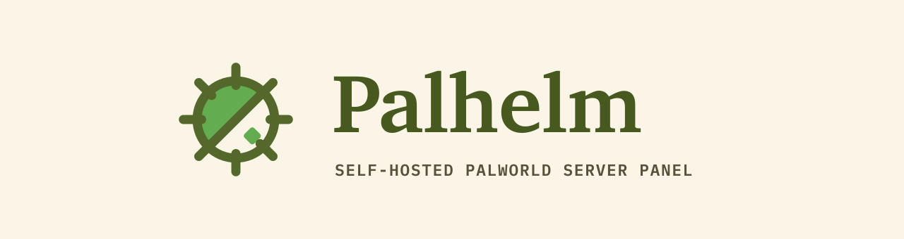
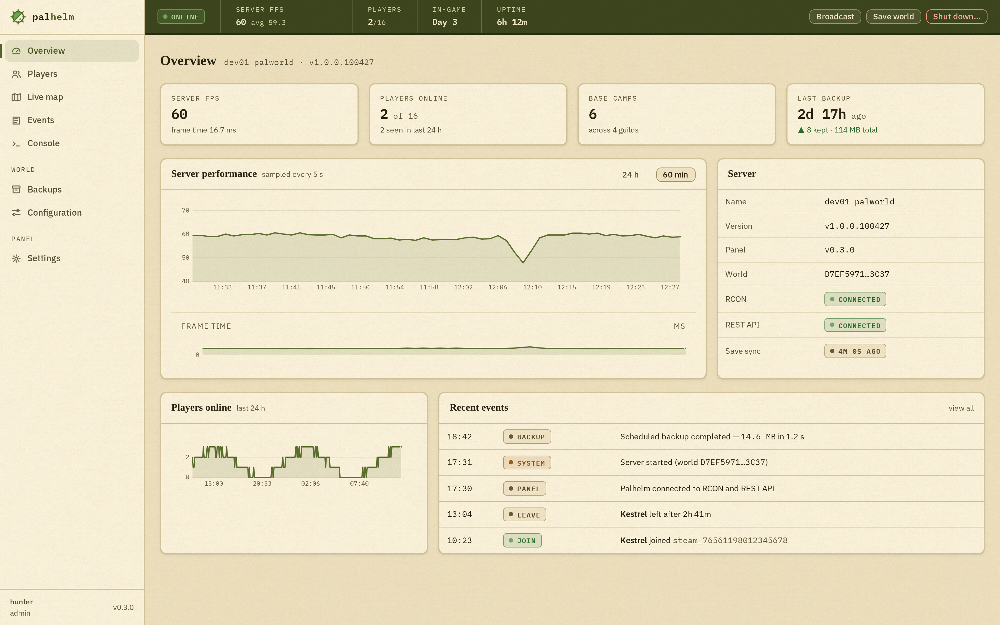

<p align="center"></p>

<p align="center">
  <a href="LICENSE"></a>
  
  
  <a href="https://palhelm.com"></a>
  <a href="https://docs.palhelm.com"></a>
  <!-- Enable once the repo is public:
  <a href="https://github.com/8tp/palhelm/actions/workflows/ci.yml"></a>
  -->
</p>

Palhelm is a self-hosted web admin panel for Palworld dedicated servers. It is one Docker image and one process with no external database. It talks to your server three ways: the official REST API, RCON, and the world save file itself, which it parses directly (the 1.0 Oodle-compressed format) with a pure-Go parser. You get a live dashboard, player and pal data, a map, safe backups and restores, and a config editor that edits the thing your server actually reads.

Full documentation lives at [docs.palhelm.com](https://docs.palhelm.com). The showcase site is [palhelm.com](https://palhelm.com). A companion Discord bot lives at [github.com/8tp/palhelm-bot](https://github.com/8tp/palhelm-bot).



## Features

- **Live dashboard.** Server FPS and frame-time history with charts, players-online history, per-channel health (REST, RCON, save sync), and an event feed.
- **Players.** Online and offline players merged from the live API and save data. Kick, ban, unban. Guild membership, playtime, and per-player pals from the save file, with real Paldeck names and locally fetched pal icons.
- **Command palette.** Players, actions, navigation, and saved RCON commands from one keystroke. Destructive entries are hidden from read-only viewers.
- **Console.** A real RCON session with history, saved commands, and an honest note about what vanilla RCON cannot do.
- **Live map.** Player and base markers on Palworld 1.0 tiles with Palpagos and World Tree layers. Tiles are game-derived art, so they are never shipped; a one-shot script downloads them into your data volume.
- **Backups.** Scheduled and manual snapshots with retention. Browse a snapshot's contents, restore with a dry-run diff and a typed confirmation. Restore refuses to run while the server is up and always takes a pre-restore backup first.
- **Config editor that tells the truth.** With the popular [thijsvanloef/palworld-server-docker](https://github.com/thijsvanloef/palworld-server-docker) image, `PalWorldSettings.ini` is regenerated from compose env vars on every boot, so editing the ini does nothing. Palhelm edits your compose file's `environment:` block instead, preserving comments and ordering, shows pending vs effective per setting, and gives you the exact host command to apply. One-click apply is intentionally disabled; see the docs for why.
- **Graceful shutdown.** Staged, cancellable player-facing countdown broadcasts. Palhelm does not claim it can start the server again; restarts belong to your host supervisor or container restart policy.
- **Roles.** Admin plus an optional read-only viewer login. The game server's admin password never reaches the browser.
- **API-first.** Everything the UI does goes through Palhelm's own documented REST API (`/api/openapi.json`). There is also a separate read-only Integration API with bearer keys for bots and scripts, with strict redaction so a leaked key cannot expose platform IDs, live positions, or moderation state.

| | |
|---|---|
|  |  |

## Quick start

> **Security first: never expose the panel to the open internet.** Bind it to localhost, a LAN, or a VPN/tailnet interface, the same advice Pocketpair gives for the game's own REST API. See [SECURITY.md](SECURITY.md).

The container image will be published at `ghcr.io/8tp/palhelm`. **It is not published yet.** Until then, build it locally from this repo:

```sh
docker build -t ghcr.io/8tp/palhelm:local .
```

Palhelm slots into the Compose project you already run your server from. Minimal service, alongside a `palworld` service:

```yaml
  palhelm:
    image: ghcr.io/8tp/palhelm:local   # use :latest once the image is published
    container_name: palhelm
    restart: unless-stopped
    depends_on:
      - palworld
    user: "1000:1000"                  # match the PUID/PGID that owns the save files
    ports:
      - "127.0.0.1:8080:8080"          # private interface only, never the internet
    environment:
      PALHELM_ADMIN_PASSWORD: "choose-a-panel-password"
      PALWORLD_REST_URL: "http://palworld:8212"
      PALWORLD_ADMIN_PASSWORD: "your-server-admin-password"
      PALWORLD_RCON_ADDR: "palworld:25575"
      PALWORLD_SAVE_DIR: "/game/Saved"
      # config editor (optional): let Palhelm edit this compose file's env block
      PALHELM_COMPOSE_FILE: "/compose/docker-compose.yml"
      PALHELM_GAME_SERVICE: "palworld"
    volumes:
      - ../data/Pal/Saved:/game/Saved   # rw: restore writes here
      - ../palhelm-data:/data           # panel DB, backups, map tiles, Oodle lib
      - ./:/compose                     # dedicated compose dir, rw, for the config editor
```

The game server side needs `RCON_ENABLED=true` and an `ADMIN_PASSWORD` (which also enables the REST API). The full annotated example, including the game service and the compose-directory layout the config editor needs, is in [examples/docker-compose.yml](examples/docker-compose.yml). The install guide at [docs.palhelm.com](https://docs.palhelm.com) walks through every step and the full configuration reference.

Optional extras, fetched once into your data volume because the art is game-derived and never shipped:

```sh
scripts/fetch-map-tiles.sh ./palhelm-data/map-tiles   # live map tiles
scripts/fetch-pal-icons.sh ./palhelm-data/pal-icons   # pal preview icons
```

## Known limits

Honest notes so you know what you are getting:

- **Save parsing depends on the game version.** Palhelm decodes the Palworld 1.0 save format (world meta, guilds, players, pals) and skips sections it does not need. If a game update drifts the format, the panel degrades that feature and shows a format-drift badge instead of breaking, but save-derived data goes stale until the parser catches up.
- **The Oodle decompressor is not bundled.** 1.0 saves are Oodle-compressed and the library is proprietary, so Palhelm downloads it once at first save parse and verifies a pinned SHA-256. Air-gapped hosts can supply the file via `PALHELM_OODLE_LIB`.
- **Vanilla RCON is limited.** No whisper, and `Broadcast` mangles spaces. Palhelm prefers the REST API for moderation and says so in the UI.
- **The game's REST API is limited too.** Some data Palhelm would like (live world actor data, for example) is not exposed by the current server build, so features that need it are not built yet.
- **Player notes are not a whitelist.** The local player ledger is annotation only. It does not control who can join. Real allow-list enforcement is deferred until a supported mechanism exists.
- **Restart is external.** Palhelm can schedule and cancel a graceful shutdown countdown, but it cannot start a stopped server. Configure host supervision separately and verify it.
- **Map tiles and pal icons are fetched, not shipped**, for licensing reasons. Until you run the fetch scripts, those screens show empty states.

## Development

Prereqs: Go (version in `backend/go.mod`) and Node 24.

```sh
make build      # frontend (npm) + backend (go) -> ./palhelm with embedded SPA
make test       # go vet + go test + frontend type check
make docker     # the shipping image
cd frontend && npm run dev -- --port 5199   # UI against mock data: http://localhost:5199/?mock
```

See [CONTRIBUTING.md](CONTRIBUTING.md) for the full dev setup, [docs/ARCHITECTURE.md](docs/ARCHITECTURE.md) for design decisions, and [docs/API.md](docs/API.md) for the API reference.

## Related

- **Discord bot:** [github.com/8tp/palhelm-bot](https://github.com/8tp/palhelm-bot), slash commands and notifications backed by the panel's Integration API.
- **Docs:** [docs.palhelm.com](https://docs.palhelm.com)
- **Site:** [palhelm.com](https://palhelm.com)

## License

Apache-2.0. See [LICENSE](LICENSE). The Palworld name, game assets, and map imagery belong to Pocketpair. Palhelm is an unaffiliated fan-made tool, built to fit within their [fan work guidelines](https://www.pocketpair.jp/en/games-en/palworld-en/).
